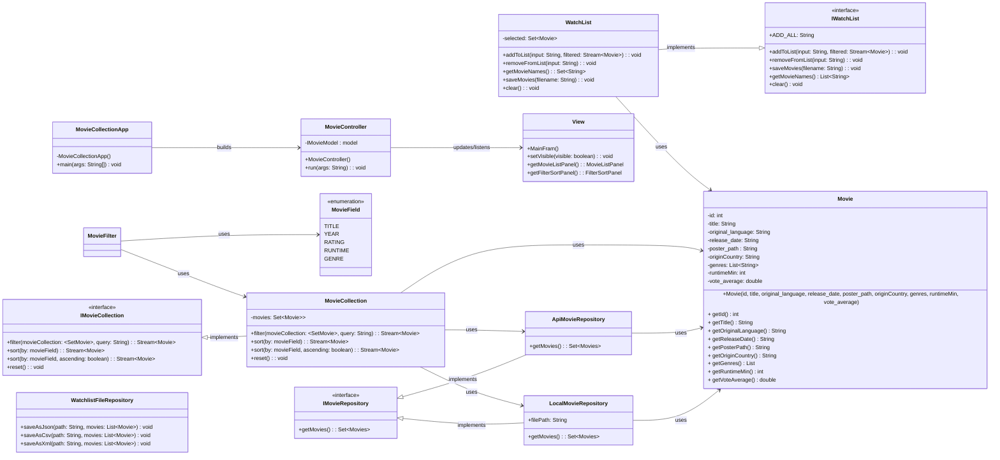

```mermaid
classDiagram
direction LR


class MovieController {
    -IMovieModel : model
    +MovieController()
    +run(args: String) : void
}

class MovieCollectionApp {
  -MovieCollectionApp()  
  +main(args: String[]) void
}

class MovieField {
    <<enumeration>>
    TITLE
    YEAR
    RATING
    RUNTIME
    GENRE
}

%% model, business logic of the application
%% ensure int can cover the movie ID range
%% capture genres from https://developer.themoviedb.org/reference/genre-movie-list, use SWITCH statement
%% We will capture the entire date and then we can filter by it accordingly
class Movie {
    -id: int
    -title: String
    -original_language: String
    -release_date: String
    -poster_path : String
    -originCountry: String
    -genres: List~String~
    -runtimeMin: int
    -vote_average: double
    +Movie(id, title, original_language, release_date, poster_path, originCountry, genres, runtimeMin, vote_average)

    + getId() int
    + getTitle() String
    + getOriginalLanguage() String
    + getReleaseDate() String
    + getPosterPath() String
    + getOriginCountry() String
    + getGenres() List
    + getRuntimeMin() int
    + getVoteAverage() double
}


%% model, represents the full collection of avail movies
%% Filtering and sorting behavior
%% reset() - removes all filters and sorts.
class IMovieCollection {
    <<interface>>
    +filter(movieCollection: ~SetMovie~, query: String) : Stream~Movie~
    +sort(by: movieField) : Stream~Movie~
    +sort(by: movieField, ascending: boolean) : Stream~Movie~
    +reset() : void
}

class MovieCollection {
    -movies: Set~Movie~>
    +filter(movieCollection: ~SetMovie~, query: String) : Stream~Movie~
    +sort(by: movieField) : Stream~Movie~
    +sort(by: movieField, ascending: boolean) : Stream~Movie~
    +reset() : void
}

IMovieCollection <|-- MovieCollection : implements

MovieCollectionApp --> MovieController : builds

%% User selected movies / user behavior
%% clear() - clears the list / resets the object's internal state
class IWatchList {
    <<interface>>
    +ADD_ALL: String
    +addToList(input: String, filtered: Stream~Movie~) : void
    +removeFromList(input: String) : void
    +saveMovies(filename: String) : void
    +getMovieNames() List~String~
    +clear() void
}

class WatchList {
  -selected: Set~Movie~
  +addToList(input: String, filtered: Stream~Movie~) : void
  +removeFromList(input: String) : void
  +getMovieNames() : Set~String~
  +saveMovies(filename: String) : void
  +clear() : void
}

WatchList --|> IWatchList : implements

%% user interface - gui ONLY
class View {
    +MainFram()
    +setVisible(visible: boolean) : void
    +getMovieListPanel(): MovieListPanel
    +getFilterSortPanel(): FilterSortPanel
}

%% model - data access layer
%% responsible for the API and file logic (i/o)
class IMovieRepository {
    <<interface>>
    +getMovies() : Set~Movies~
}

%% retrieve data from local source
class LocalMovieRepository{
    +filePath: String
    +getMovies() : Set~Movies~
}

%% retrieve data from an API source
class ApiMovieRepository{
    +getMovies() : Set~Movies~
}

LocalMovieRepository --> Movie : uses
ApiMovieRepository --> Movie : uses
IMovieRepository <|-- LocalMovieRepository : implements
IMovieRepository <|-- ApiMovieRepository : implements
MovieFilter --> MovieField : uses
MovieController --> View : updates/listens
MovieCollection --> LocalMovieRepository : uses
MovieCollection --> ApiMovieRepository : uses
MovieCollection --> Movie : uses
MovieFilter --> MovieCollection : uses

WatchList --> Movie: uses

class WatchlistFileRepository {
  +saveAsJson(path: String, movies: List~Movie~) void
  +saveAsCsv(path: String, movies: List~Movie~) void
  +saveAsXml(path: String, movies: List~Movie~) void
}


```