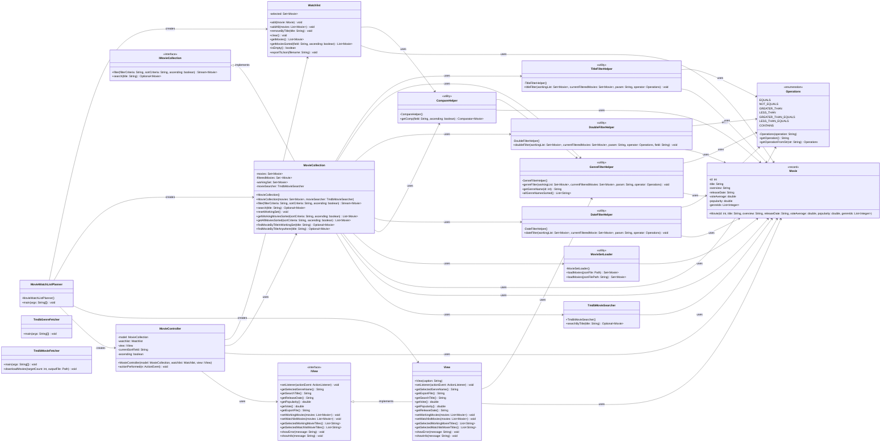

```mermaid
classDiagram
direction LR

%% PROGRAM ENTRY POINT 
class MovieWatchListPlanner {
    -MovieWatchListPlanner()
    +main(args: String[]) void
}

%% CONTROLLER
class MovieController {
    -model: MovieCollection
    -watchlist: Watchlist
    -view: IView
    -currentSortField: String
    -ascending: boolean
    +MovieController(model: MovieCollection, watchlist: Watchlist, view: IView)
    +actionPerformed(e: ActionEvent) void
}

%% VIEW
%% view interface
class IView {
    <<interface>>
    +setListener(actionEvent: ActionListener) void
    +getSelectedGenreName() String
    +getSearchTitle() String
    +getReleaseDate() String
    +getPopularity() double
    +getVote() double
    +getExportFile() String
    +setWorkingMovies(movies: List~Movie~) void
    +setWatchlistMovies(movies: List~Movie~) void
    +getSelectedWorkingMovieTitles() List~String~
    +getSelectedWatchlistMovieTitles() List~String~
    +showError(message: String) void
    +showInfo(message: String) void
}

%% view implementation
class View {
    +View(caption: String)
    +setListener(actionEvent: ActionListener) void
    +getSelectedGenreName() String
    +getExportFile() String
    +getSearchTitle() String
    +getVote() double
    +getPopularity() double
    +getReleaseDate() String
    +setWorkingMovies(movies: List~Movie~) void
    +setWatchlistMovies(movies: List~Movie~) void
    +getSelectedWorkingMovieTitles() List~String~
    +getSelectedWatchlistMovieTitles() List~String~
    +showError(message: String) void
    +showInfo(message: String) void
}

%% MODEL, business logic of the application
class IMovieCollection {
    <<interface>>
    +filter(filterCriteria: String, sortCriteria: String, ascending: boolean) Stream~Movie~
    +search(title: String) Optional~Movie~
}

class MovieCollection {
    -movies: Set~Movie~
    -filteredMovies: Set ~Movie~
    -workingSet: Set~Movie~
    -movieSearcher: TmdbMovieSearcher
    +MovieCollection()
    +MovieCollection(movies: Set~Movie~, movieSearcher: TmdbMovieSearcher)
    +filter(filterCriteria: String, sortCriteria: String, ascending: boolean) Stream~Movie~
    +search(title: String) Optional~Movie~
    +resetWorkingSet() void
    +getWorkingMoviesSorted(sortCriteria: String, ascending: boolean) List~Movie~
    +getAllMoviesSorted(sortCriteria: String, ascending: boolean) List~Movie~
    +findMovieByTitleInWorkingSet(title: String) Optional~Movie~
    +findMovieByTitleAnywhere(title: String) Optional~Movie~
}

class Movie {
    <<record>>
    -id: int
    -title: String
    -overview: String
    -releaseDate: String
    -voteAverage: double
    -popularity: double
    -genreIds: List~Integer~
    +Movie(id: int, title: String, overview: String, releaseDate: String, voteAverage: double, popularity: double, genreIds: List~Integer~)
}

%% User behavior
class Watchlist {
    -selected: Set~Movie~
    +add(movie: Movie) void
    +addAll(movies: List~Movie~) void
    +removeByTitle(title: String) void
    +clear() void
    +getMovies() List~Movie~
    +getMoviesSorted(field: String, ascending: boolean) List~Movie~
    +isEmpty() boolean
    +exportToJson(filename: String) void
}

%% retrieve data from local source
class MovieSetLoader{
    <<utility>>
    -MovieSetLoader()
    +loadMovies(jsonFile: Path) Set~Movie~
    +loadMovies(jsonFilePath: String) Set~Movie~
}

%% HELPERS
class CompareHelper {
    <<utility>>
    -CompareHelper()
    +getComp(field: String, ascending: boolean) Comparator~Movie~
}

class DateFilterHelper {
    <<utility>>
    -DateFilterHelper()
    +dateFilter(workingList: Set~Movie~, currentFilteredMovie: Set~Movie~, param: String, operator: Operations) void
}

class DoubleFilterHelper {
    <<utility>>
    -DoubleFilterHelper()
    +doubleFilter(workingList: Set~Movie~, currentFilteredMovies: Set~Movie~, param: String, operator: Operations, field: String) void
}

class GenreFilterHelper {
    <<utility>>
    -GenreFilterHelper()
    +genreFilter(workingList: Set~Movie~, currentFilteredMovies: Set~Movie~, param: String, operator: Operations) void
    +getGenreName(id: int) String
    +allGenreNamesSorted() List~String~
}

class TitleFilterHelper {
    <<utility>>
    -TitleFilterHelper()
    +titleFilter(workingList: Set~Movie~, currentFilteredMovies: Set~Movie~, param: String, operator: Operations) void
}

%% DATA

%% api fallback search
class TmdbMovieSearcher {
    +TmdbMovieSearcher()
    +searchByTitle(title: String) Optional~Movie~
}

%% DATA SCRIPTS
class TmdbGenreFetcher {
    +main(args: String[]) void
}

class TmdbMovieFetcher {
    +main(args: String[]) void
    +downloadMovies(targetCount: int, outputFile: Path) void
}

%% ENUMS
class Operations {
    <<enumeration>>
    EQUALS
    NOT_EQUALS
    GREATER_THAN
    LESS_THAN
    GREATER_THAN_EQUALS
    LESS_THAN_EQUALS
    CONTAINS
    -Operations(operation: String)
    +getOperation() String
    +getOperationFromStr(str: String) Operations
}

%% RELATIONSHIPS
MovieWatchListPlanner --> MovieController : creates
MovieWatchListPlanner --> View : creates
MovieWatchListPlanner --> MovieCollection: creates
MovieWatchListPlanner --> Watchlist: creates

MovieController --> IView : uses
MovieController --> Movie : uses
MovieController --> MovieCollection : uses
MovieController --> Watchlist : uses

IView <|-- View : implements
View --> Movie : uses
View --> GenreFilterHelper : uses

IMovieCollection <|-- MovieCollection : implements
MovieCollection --> TmdbMovieSearcher : uses
MovieCollection --> Movie : uses
MovieCollection --> Operations : uses
MovieCollection --> MovieSetLoader : uses
MovieCollection --> CompareHelper : uses
MovieCollection --> DateFilterHelper : uses
MovieCollection --> DoubleFilterHelper : uses
MovieCollection --> GenreFilterHelper : uses
MovieCollection --> TitleFilterHelper : uses

Watchlist --> Movie : uses
Watchlist --> CompareHelper : uses

MovieSetLoader --> Movie : uses

CompareHelper --> Movie : uses
CompareHelper --> GenreFilterHelper : uses
DateFilterHelper --> Movie : uses
DateFilterHelper --> Operations : uses
DoubleFilterHelper --> Movie : uses
DoubleFilterHelper --> Operations : uses
GenreFilterHelper --> Movie : uses
GenreFilterHelper --> Operations : uses
TitleFilterHelper --> Movie : uses
TitleFilterHelper --> Operations : uses

TmdbMovieSearcher --> Movie : uses

```